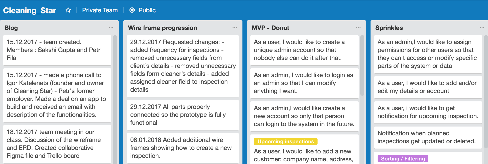
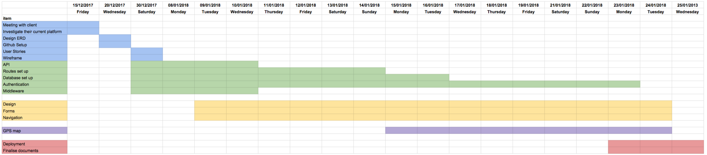
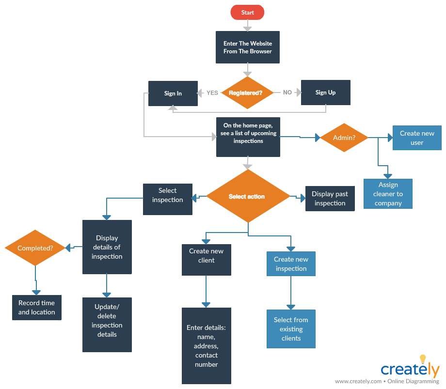
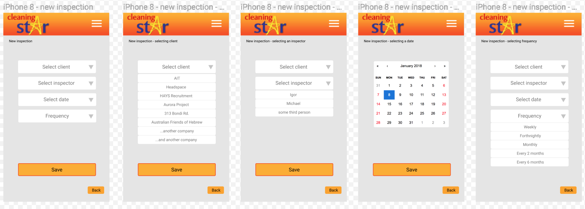
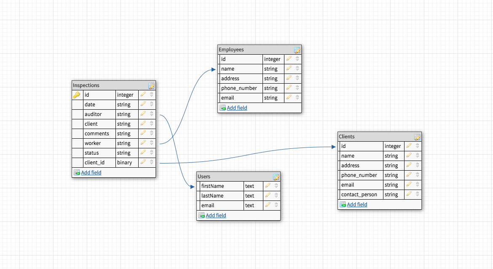

# Cleaning Star

## Overview

* [Project brief](#project-brief)
* [Problem](#problem)
* [Solution](#solution)
* [Technology stack](#technology-stack)
* [Concept, Design & Build](#concept-design-build)
  * [Concept](#concept)
  * [Design](#design)
  * [Build](#build)
* [User stories](#user-stories)
* [Timeline](#timeline)
* [User flow](#user-flow)
* [Wireframe](#wireframe)
* [Back-end: DB schema design](#back-end)
* [Style guide](#style-guide)
  * [CSS](#css)
  * [Colours](#colours)
  * [Font Style](#font-style)
* [Setup](#setup)
* [Outstanding Issues](#outstanding-issues)
* [Challenges](#challenges)
* [Team Notes](#team-notes)

## Project Brief

Cleaning Star is a small-medium cleaning company located in Sydney. The biggest challenge facing Cleaning Star is the ability to audit the quality of their cleaning and recording the audit by inspectors.

[Return to overview](#overview)

## Problem

To audit the quality of their cleaner’s cleaning, the company will send inspectors to their client’s location and conduct an audit and document their activities. The owner/admin will schedule a time for an inspection for various clients and the inspector will record any issues. This is all done manually and the owner/admin must wait for the inspector to return to record the inspectors’ report separately. The owner/admin also does not have a way to verify that his inspectors have physically arrived on site to carry out the inspection. This is time consuming and can be very frustrating to collate all documents by one admin.

[Return to overview](#overview)

## Solution

Our proposal to the company is to create an app that can be accessed anywhere, that will streamline all of the above into a single app. We believe that this will enable Cleaning Star to improve its efficiency in recording audits, verifying completed inspections, and collating all documents into a single database.

The app will be used by one owner/admin and a small number of inspectors to manage the tasks that need to be completed and document any issues that may arise. The admin may create additional users (inspectors). Both admin and inspectors can add clients to the database. Both admin and inspectors can schedule new inspections which will be added to an inspection list on the homepage.

Once the the inspection is completed, the inspector will document any issues, record their gps location within the app, and save it to the database. This enables the owner/admin to view all documents in a one app and to verify his inspectors were physically on site to conduct the audit.

[Return to overview](#overview)

## Technology Stack

Front-end:
* ReactJs, HTML, CSS, Materialize  

Back-end:
* NodeJs, MongoDB

[Return to overview](#overview)

## Concept, Design and build

To kick off the project, We talked to the owner of the company, Cleaning Star, to determine the requirements and expectations for the project. After gathering the information, we went ahead to create a low fidelity sketch and a high fidelity wireframe of the document keeping platform.

[Return to overview](#overview)

### Concept

We drew low fidelity sketches on a whiteboard and concentrated on mobile first design.
Concepts include:
* Authentication to allow only certain people access to the database
* Button to create a new listings of inspections, employees, and clients
* A list to display existing inspections, employees, clients, and their details (name, contact, address)
* GPS location recording
* Instant document creation, saving, and linked to individual inspections/clients

[Return to overview](#overview)

### Design

Next we used Figma to create high fidelity designs of the hand drawn concepts and further refine the user interface.

[Return to overview](#overview)

### Build

We built the MVP with NodeJs and React. We used Materialize with React.

[Return to overview](#overview)

## User stories

User stories can be found [here](https://trello.com/b/OifI0ROt/cleaningstar).

[Return to overview](#overview)

## Timeline

This was the projected timeline of the app.

[Return to overview](#overview)

## User flow

This is the user flow we designed.

[Return to overview](#overview)

## Wireframe

The wireframe can be found [here](https://www.figma.com/file/TSLHsT4gpyxA0cvavU0hGcWi/Inspection-app).

[Return to overview](#overview)

## Back-end

As for the backend, we have planned the DB schema as follows to serve as a reference when building the backend Node database.

[Return to overview](#overview)

## Style Guide

### CSS

The decision was made to use Materialize due to its ease of use and existing components (such as buttons, cards, forms, date-picker, side-nav). We believe that this front-end framework will enhance the user experience.

[Return to overview](#overview)

### Colours

Colours selected for the app were based on the client's existing website and other custom apps previously built for the company.
From this, the theme was created with complementary shades for an unobtrusive and clear user experience.

Item | Colour | RGB | Hex  
---: | -----:| -----:| ---
Primary 1 |  | 245,124,0 | #F57C00   
Secondary 1 |  | 181,255,252 | #B5FFFC
Secondary 2 |  | 255,222,233 | #FFDEE9
Font |  | 198,40,40 | #C62828

[Return to overview](#overview)

### Font Style

We wanted to present a cleanly designed style so it's easy for the user to skim the content. To do this, only one font was selected for everything so every page will be uniform and prevents the app from becoming too busy with changing fonts. We chose a popular sans-serif font, RALEWAY, available from [Google Fonts](https://fonts.google.com/specimen/Raleway). We chose RALEWAY because it's a simple, clean font.

[Return to overview](#overview)

## Setup

Clone the repo:

`$ git clone https://github.com/Codewick/Cleaning_star.git`

Then in the folders, api and react, run:

`$ yarn install`

In api folder, run:

`$ yarn dev`

In react folder, run:

`$ yarn start`

[Return to overview](#overview)

## Outstanding Issues

Please see [issues](https://github.com/Codewick/Cleaning_star/issues) for existing bugs with the app.

[Return to overview](#overview)

## Challenges

During the build of the app, we’ve run into multiple roadblocks.

The biggest challenge was authentication. Throughout the three weeks, we struggled to get this feature function correctly. Eventually, Petr was able to get it working, however it only worked on his laptop and not on the other team members’ laptops. This caused problems for other team members because other members were not able to access to the database within the app without logging in. This occurred a couple of days from the due date so we decided to pair program to avoid wasting time to get the authentication working on our laptops.

Another challenge was building CRUD functions into our app. We were able to get Create, Read, and Delete working, however the Update proved to be more challenging.

Another issue we had was deployment. When we tried to deploy the app to netlify, it caused issues with the materialize framework. We’ve discussed with another team that was also using materialize and they seemed to be able to deploy without issues from materialize so we had to research for a solution ourselves. According to the error, icons were loaded incorrectly because chrome was attempting to retrieve the icons from an insecure source.

The solution was changing this line in index.html:
`http://fonts.googleapis.com/icon?family=Material+Icons`
To this:
`https://fonts.googleapis.com/icon?family=Material+Icons`

[Return to overview](#overview)

## Team Notes

We made a team decision about a possibility to use Axios for fetching data from our API or using `.fetch()` ReactJS in-build function. We've decided for  `.fetch()`  as it has already been used for one of our component.
` https://medium.com/@thejasonfile/fetch-vs-axios-js-for-making-http-requests-2b261cdd3af5 `

[Return to overview](#overview)
